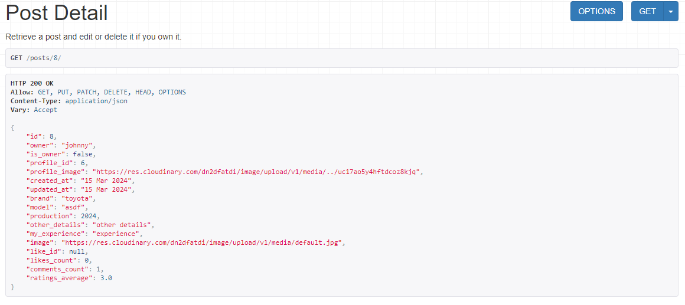

# RideReview

## Project Structure
### Project Apps
- profile app: This app contains model, views, serializers, and urls for profile
- posts app: This app contains model, views, serializers, and urls for posts
- comments app: This app contains model, views, serializers, and urls for comments
- like app: This app contains model, views, serializers, and urls for like
- followers app: This app contains model, views, serializers, tests and urls for followers

## User Stories

### Profiles
- As a user, I can view lists of profiles so that I can see all the profiles have been created.  
- As a user, I can get each profile by id so that I can see individual profile data. 
- As a logged-in user, I can get my profile by id so that I can update my profile data when I want.
- As a logged-in user, I can filter profiles so that I can list the profiles according to my wishes. 

### Posts
- As a user, I can view a list of all posts so that I can see all posts have been posted.
- As a user, I can get each post by id so that I can see individual post content.
- As a logged-in user , I can create a post so that I can post it to be visible for other users.
- As a logged-in user, I can get my posts by id so that I can edit or delete them.
- As a logged-in user, I can filter/search posts so that I can list the posts according to my wishes.

### Comments
- As a user, I can view a list of all comments so that I can see all comments have been created.
- As a user, I can get each comment by id so that I can see individual comment content.
- As a logged-in user, I can add comments to the posts so that I can interact with various people regarding a post.
- As a logged-in user, I can retrieve my comments by their id so that I can edit/delete the comment.
- As a logged-in user, I can filter/search comments so that I can list the comments according to my wishes.

### Likes
- As a user, I can view the list of likes so that I can see all the likes created in the API for the posts.
- As a user, I can retrieve likes by id so that I can see individual like content.
- As a logged-in user, I can like a post so that I can express interest in the post.
- As a logged-in user, I can remove my like from a post, so that I can change my opinion about a post.

### Followers
- As a user, I can view a list of followers so that I can see who is following whom.
- As a user, I can retrieve followers by id so that I can see individual follower content.
- As a logged-in user, I can make a follow so that I can follow my favorite user.
- As a logged-in user, I can delete a follow so that I can unfollow a followed user.

## Technologies Used

### Languages & Frameworks

- Python 3.10.2
- Django
- Django Rest Framework

### Libraries & Tools

- [Cloudinary](https://cloudinary.com/) to store images for profile and events
- [CI Python Linter](https://pep8ci.herokuapp.com/) was used for validation of python files.
- [Lucidcharts](https://lucid.app/) has been used in project to design and document data model architecture.
- [CodeAnyWhere](https://app.codeanywhere.com/) was IDE used for writing code and to push the code to GitHub
- [GitHub](https://github.com/) was used as a remote repository to store project code
- [Heroku](https://heroku.com) - Cloud platform. Justification: I used this was used to deploy the project into live environment
- [Django REST Framework](https://www.django-rest-framework.org/) - API toolkit. Justification: I used this to build the back-end API
- [Django AllAuth](https://django-allauth.readthedocs.io/en/latest/index.html) - API Module. Justification: I used this for user authentication
- [Psycopg2](https://www.psycopg.org/docs/) - PostgreSQL database adaptor. Justification: This was used as a PostgreSQL database adapter for Python
- [ElephantSQL](https://www.elephantsql.com/) - Database hosting service – Justification: This was used as the deployed project on Heroku uses an ElephantSQL database

### All libraries for deployment in Heroku

- All libraries is stored in requirements.txt for deployment in heroku

All libraries

## Agile design

### User Story Template

- Using Github issues first I created the template for a user story that was later used to create user stories. I created four labels: must have, could have, should have.

See User story template

### Kanban Board

- As a visual representation of the project's status, showing what tasks are to be done, in progress and completed.Each task is represented as a card on the board, and the cards can be moved from one column to another to show progress.

[Link to project Kanban board.](https://github.com/users/Sinha5714/projects/6)

See Kanban board

### Moscow Prioritisation

- The Moscow prioritization technique is used to prioritize project requirements based on their importance.

See Image

### Milestones

- Milestones are created with a aim of finishing a task on a certain date. I have created 7 milestones for this project and linked them with issues related.

See Image

## Database Design

---

(ERD)Physical database model

- This sample ERD diagram was made using [Lucid Charts](https://www.lucidchart.com)
- For this Django app I have used PostgreSQL relational database management system.
- model showed on the diagram visually represents the structure of a PostgreSQL database, including tables, columns, relationships, and constraints, that is stored in the database itself.

### Data Models

#### User Model

- User model as part of the Django Rest Framework dj-rest-auth library contains basic information about authenticated user and contains folowing fields:
  Username, Password, Email

  #### Profile Model
 

- The Profile model is created to store additional information about users for better interaction with the website.

| Name       | Database Key | Field Type    | Validation                                      |
| ---------- | ------------ | ------------- | ----------------------------------------------- |
| owner      | owner        | OneToOneField | User, on_delete=models.CASCADE                  |
| created_at | created_at   | DateTimeField | auto_now_add=True                               |
| updated_at | updated_at   | DateTimeField | auto_now=True                                   |
| name       | name         | CharField     | max_length=255, blank=True                      |
| content    | content      | TextField     | blank=True                                      |
| image      | image        | ImageField    | upload_to='pp5/images/profile', default='../scpevcha1fo1rxmc3f2o' |

#### Post Model
The Post model is created to store information about posts made by users.

| Name           | Database Key | Field Type    | Validation                                      |
| -------------- | ------------ | ------------- | ----------------------------------------------- |
| owner          | owner        | ForeignKey    | User, on_delete=models.CASCADE                  |
| created_at     | created_at   | DateTimeField | auto_now_add=True                               |
| updated_at     | updated_at   | DateTimeField | auto_now=True                                   |
| brand          | brand        | CharField     | max_length=255, blank=False                     |
| model          | model        | CharField     | max_length=255, blank=False                     |
| production     | production   | IntegerField  | blank=False, null=False                         |
| other_details  | other_details| CharField     | max_length=260                                  |
| my_experience  | my_experience| TextField     | blank=False                                     |
| image          | image        | ImageField    | upload_to='pp5/images/cars', blank=False        |

#### Comment Model

The Comment model is created to store information about comments made by users on posts. The ratings_average field in the Comment model represents the average rating which is calculated based on the stars field provided by users for comments on the same post. 

| Name            | Database Key   | Field Type    | Validation                                      |
| --------------- | -------------- | ------------- | ----------------------------------------------- |
| owner           | owner          | ForeignKey    | User, on_delete=models.CASCADE                  |
| post            | post           | ForeignKey    | Post, on_delete=models.CASCADE                  |
| created_at      | created_at     | DateTimeField | auto_now_add=True                               |
| updated_at      | updated_at     | DateTimeField | auto_now=True                                   |
| content         | content        | TextField     | max_length=1000, blank=False, default='comment' |
| stars           | stars          | PositiveIntegerField | default=0                                  |
| ratings_average | ratings_average| FloatField    | default=0                                       |

#### Like Model

The Like model is designed to represent likes made by users on posts.

| Name       | Database Key | Field Type | Validation                         |
| ---------- | ------------ | ---------- | ---------------------------------- |
| owner      | owner        | ForeignKey | User, on_delete=models.CASCADE    |
| post       | post         | ForeignKey | Post, related_name='likes', on_delete=models.CASCADE |
| created_at | created_at   | DateTimeField | auto_now_add=True                 |

#### Follower Model

The Follower model represents the relationship between users who follow each other.

| Name       | Database Key | Field Type | Validation                               |
| ---------- | ------------ | ---------- | ---------------------------------------- |
| owner      | owner        | ForeignKey | User, related_name='following', on_delete=models.CASCADE |
| followed   | followed     | ForeignKey | User, related_name='followed', on_delete=models.CASCADE |
| created_at | created_at   | DateTimeField | auto_now_add=True                       |

## Features

### Home Page

- This is the welcoming page for all users
- Once user opens the API site, this page appears in front of him.

See API Site Homepage

### Profile List Page

- This page consists of profile list of all users
- **User Story Covered**: 1

See Profile List Page

### Profile Detail Page

- This page consists of profile detail page
- If user is owner he can edit and delete his profile
- **User Story Covered**: 2, 3, 4

See Profile Detail Page

See Profile Owner Detail Page

### Post List Page

- This page consists of event list of all posts which have been created
- This page also consist a post create form for logged in user

See Post List Page

See Post List - Create Form 

### Post Detail Page

- This page consists of post detail
- If user is owner he can edit and delete his post what he has created

See Post Detail Page

See Post Create Form

See Post Owner Edit Form

### Comments List Page

- This page consists of comments list of all comments posted for posts
- This page also consist a comment create form for logged in user with post options

See Comments List Page

See Comments Create Form 

### Comment Detail Page

- This page consists of comment detail
- If user is owner he can edit and delete his comments what he has posted

See Comment Detail Page with Edit form

### Likes List Page

- This page consists of likes list for a post
- This page also consist a like create form for logged in user with post options
- If user want to like again a validation error is thrown

See likes list Page with Create Form

### like Detail Page

- This page consists of like detail
- If can delete his like

See like Detail Page

### Followers List Page

- This page consists of followers list of all user following each other
- This page also consist a followers create form for logged in user with other users options
- If user want to follow a followed user again a validation error is thrown

See Follower List Page with Create Form

### Followers Detail Page

- This page consists of followers detail
- If user has followed another user he can delete his follow

See Followers Detail Page

