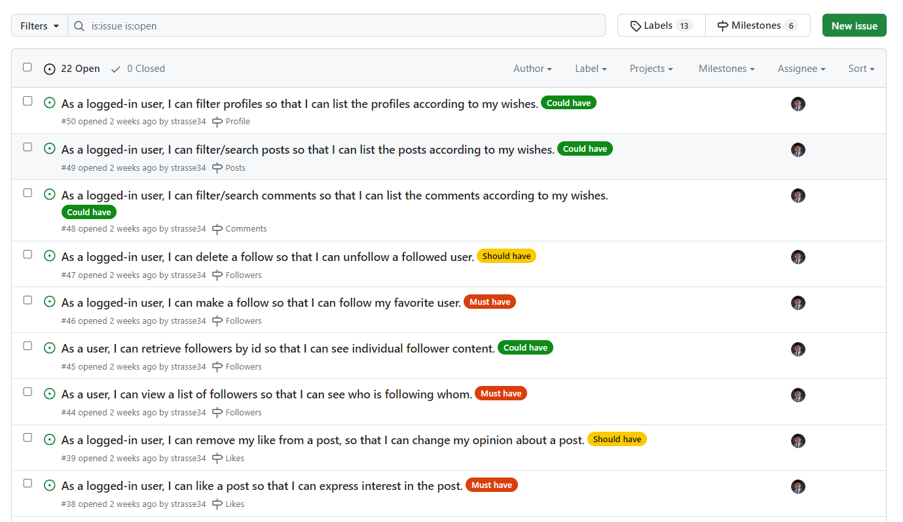
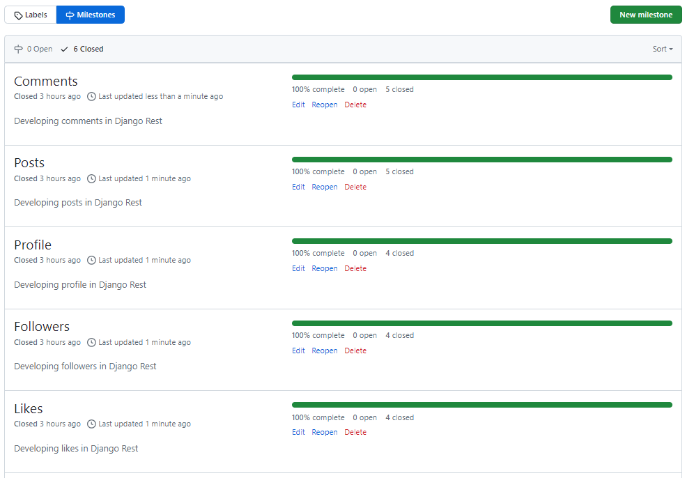
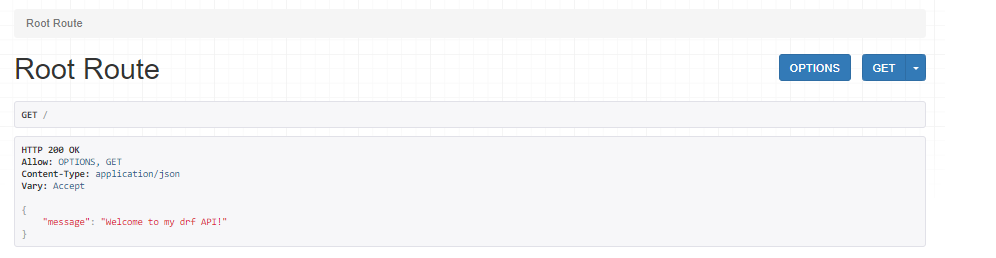
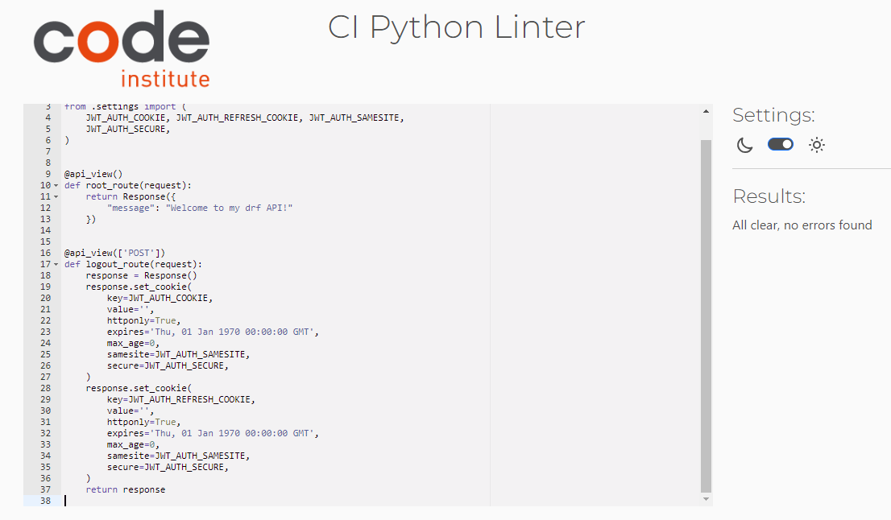
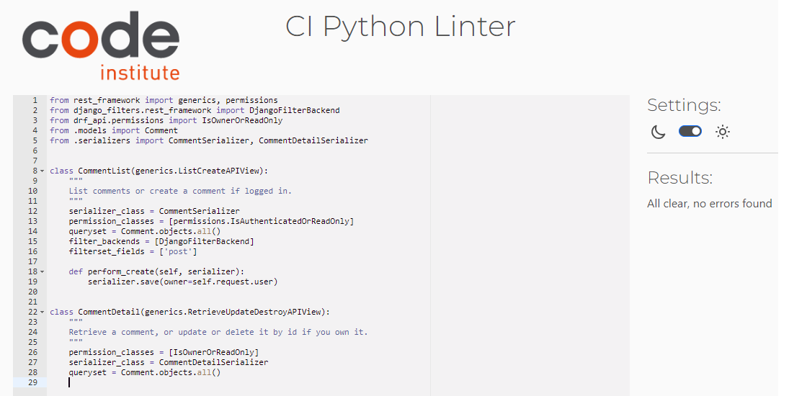

# RideReview

**Developer: Reza Mirzaie**

💻 [Live link](https://rr-drf-api-d27ae746a106.herokuapp.com/)

This repository contains the API set up using Django REST Framework for the Ride Review front-end application

## Table of Contents

- [Project Structure](#project-structure)
  - [Project Apps](#project-apps)
- [User Stories](#user-stories)
  - [Profiles](#profiles)
  - [Posts](#posts)
  - [Comments](#comments)
  - [Likes](#likes)
  - [Followers](#followers)
- [Technologies Used](#technologies-used)
  - [Languages & Frameworks](#languages--frameworks)
  - [Libraries & Tools](#libraries--tools)
  - [All libraries for deployment in Heroku](#all-libraries-for-deployment-in-heroku)
- [Agile design](#agile-design)
  - [User Story Template](#user-story-template)
  - [Kanban Board](#kanban-board)
  - [Moscow Prioritisation](#moscow-prioritisation)
  - [Milestones](#milestones)
- [Database Design](#database-design)
  - [Data Models](#data-models)
    - [User Model](#user-model)
    - [Profile Model](#profile-model)
    - [Post Model](#post-model)
    - [Comment Model](#comment-model)
    - [Like Model](#like-model)
    - [Follower Model](#follower-model)
- [Features](#features)
  - [Home Page](#home-page)
  - [Profile List Page](#profile-list-page)
  - [Profile Detail Page](#profile-detail-page)
  - [Post List Page](#post-list-page)
  - [Post Detail Page](#post-detail-page)
  - [Comments List Page](#comments-list-page)
  - [Comment Detail Page](#comment-detail-page)
  - [Likes List Page](#likes-list-page)
  - [Like Detail Page](#like-detail-page)
  - [Followers List Page](#followers-list-page)
  - [Followers Detail Page](#followers-detail-page)
- [Validation](#validation)
  - [Python](#python)
    - [drf_api Project](#drf_api-project)
    - [Profiles App](#profiles-app)
    - [Post App](#post-app)
    - [Comments App](#comments-app)
    - [Likes App](#likes-app)
    - [Followers App](#followers-app)
- [Testing](#testing)
- [Deployment](#deployment)
  - [Creating Database using ElephantSQL](#creating-database-using-elephantsql)
  - [Deploying the website in Heroku](#deploying-the-website-in-heroku)
    - [Login or create an account at Heroku](#login-or-create-an-account-at-heroku)
    - [Creating an app](#creating-an-app)
    - [Open settings Tab](#open-settings-tab)
      - [Click on config var](#click-on-config-var)
      - [Add Buildpacks](#add-buildpacks)
    - [Open Deploy Tab](#open-deploy-tab)
      - [Choose deployment method](#choose-deployment-method)
      - [Connect to Github](#connect-to-github)
      - [Automatic and Manual deploy](#automatic-and-manual-deploy)
      - [Deployment](#deployment-1)
    - [Forking the GitHub Repository](#forking-the-github-repository)
    - [Cloning the repository in GitHub](#cloning-the-repository-in-github)
- [Credits](#credits)
  - [Code](#code)
- [Thank You](#thank-you)

## Project Structure
### Project Apps
- profile app: This app contains model, views, serializers, and urls for profile
- posts app: This app contains model, views, serializers, and urls for posts
- comments app: This app contains model, views, serializers, and urls for comments
- like app: This app contains model, views, serializers, and urls for like
- followers app: This app contains model, views, serializers, tests and urls for followers

## User Stories

### Profiles
- As a user, I can view lists of profiles so that I can see all the profiles have been created.  
- As a user, I can get each profile by id so that I can see individual profile data. 
- As a logged-in user, I can get my profile by id so that I can update my profile data when I want.
- As a logged-in user, I can filter profiles so that I can list the profiles according to my wishes. 

### Posts
- As a user, I can view a list of all posts so that I can see all posts have been posted.
- As a user, I can get each post by id so that I can see individual post content.
- As a logged-in user , I can create a post so that I can post it to be visible for other users.
- As a logged-in user, I can get my posts by id so that I can edit or delete them.
- As a logged-in user, I can filter/search posts so that I can list the posts according to my wishes.

### Comments
- As a user, I can view a list of all comments so that I can see all comments have been created.
- As a user, I can get each comment by id so that I can see individual comment content.
- As a logged-in user, I can add comments to the posts so that I can interact with various people regarding a post.
- As a logged-in user, I can retrieve my comments by their id so that I can edit/delete the comment.
- As a logged-in user, I can filter/search comments so that I can list the comments according to my wishes.

### Likes
- As a user, I can view the list of likes so that I can see all the likes created in the API for the posts.
- As a user, I can retrieve likes by id so that I can see individual like content.
- As a logged-in user, I can like a post so that I can express interest in the post.
- As a logged-in user, I can remove my like from a post, so that I can change my opinion about a post.

### Followers
- As a user, I can view a list of followers so that I can see who is following whom.
- As a user, I can retrieve followers by id so that I can see individual follower content.
- As a logged-in user, I can make a follow so that I can follow my favorite user.
- As a logged-in user, I can delete a follow so that I can unfollow a followed user.

## Front End

### React JS
This API is used to manage Back-End and database for the Front-End application which has built by React JS. The repository with a README file for the Front-End can be found [here](https://github.com/strasse34/pp5).

## Technologies Used

### Languages & Frameworks

- Python 3.10.2
- Django
- Django Rest Framework

### Libraries & Tools

- [Cloudinary](https://cloudinary.com/) to store images for profile and events
- [CI Python Linter](https://pep8ci.herokuapp.com/) was used for validation of python files.
- [Lucidcharts](https://lucid.app/) has been used in project to design and document data model architecture.
- [CodeAnyWhere](https://app.codeanywhere.com/) was IDE used for writing code and to push the code to GitHub
- [GitHub](https://github.com/) was used as a remote repository to store project code
- [Heroku](https://heroku.com) - Cloud platform. Justification: I used this was used to deploy the project into live environment
- [Django REST Framework](https://www.django-rest-framework.org/) - API toolkit. Justification: I used this to build the back-end API
- [Django AllAuth](https://django-allauth.readthedocs.io/en/latest/index.html) - API Module. Justification: I used this for user authentication
- [Psycopg2](https://www.psycopg.org/docs/) - PostgreSQL database adaptor. Justification: This was used as a PostgreSQL database adapter for Python
- [ElephantSQL](https://www.elephantsql.com/) - Database hosting service – Justification: This was used as the deployed project on Heroku uses an ElephantSQL database

### All libraries for deployment in Heroku

- All libraries is stored in requirements.txt for deployment in heroku

All libraries

## Agile design

### User Story Template

- Using Github issues first I created the template for a user story that was later used to create user stories. I created four labels: must have, could have, should have.

See User story template

### Kanban Board

- As a visual representation of the project's status, showing what tasks are to be done, in progress and completed.Each task is represented as a card on the board, and the cards can be moved from one column to another to show progress.

See Kanban board

### Moscow Prioritisation

- The Moscow prioritization technique is used to prioritize project requirements based on their importance.

See Image

### Milestones

- Milestones are created with a aim of finishing a task on a certain date. I have created 5 milestones for this project and linked them with issues related.

See Image

## Database Design

---

(ERD)Physical database model

- This sample ERD diagram was made using [Lucid Charts](https://www.lucidchart.com)
- For this Django app I have used PostgreSQL relational database management system.
- model showed on the diagram visually represents the structure of a PostgreSQL database, including tables, columns, relationships, and constraints, that is stored in the database itself.

### Data Models

#### User Model

- User model as part of the Django Rest Framework dj-rest-auth library contains basic information about authenticated user and contains folowing fields:
  Username, Password, Email

  #### Profile Model
 

- The Profile model is created to store additional information about users for better interaction with the website.

| Name       | Database Key | Field Type    | Validation                                      |
| ---------- | ------------ | ------------- | ----------------------------------------------- |
| owner      | owner        | OneToOneField | User, on_delete=models.CASCADE                  |
| created_at | created_at   | DateTimeField | auto_now_add=True                               |
| updated_at | updated_at   | DateTimeField | auto_now=True                                   |
| name       | name         | CharField     | max_length=255, blank=True                      |
| content    | content      | TextField     | blank=True                                      |
| image      | image        | ImageField    | upload_to='pp5/images/profile', default='../scpevcha1fo1rxmc3f2o' |

#### Post Model
The Post model is created to store information about posts made by users.

| Name           | Database Key | Field Type    | Validation                                      |
| -------------- | ------------ | ------------- | ----------------------------------------------- |
| owner          | owner        | ForeignKey    | User, on_delete=models.CASCADE                  |
| created_at     | created_at   | DateTimeField | auto_now_add=True                               |
| updated_at     | updated_at   | DateTimeField | auto_now=True                                   |
| brand          | brand        | CharField     | max_length=255, blank=False                     |
| model          | model        | CharField     | max_length=255, blank=False                     |
| production     | production   | IntegerField  | blank=False, null=False                         |
| other_details  | other_details| CharField     | max_length=260                                  |
| my_experience  | my_experience| TextField     | blank=False                                     |
| image          | image        | ImageField    | upload_to='pp5/images/cars', blank=False        |

#### Comment Model

The Comment model is created to store information about comments made by users on posts. The ratings_average field in the Comment model represents the average rating which is calculated based on the stars field provided by users for comments on the same post. 

| Name            | Database Key   | Field Type    | Validation                                      |
| --------------- | -------------- | ------------- | ----------------------------------------------- |
| owner           | owner          | ForeignKey    | User, on_delete=models.CASCADE                  |
| post            | post           | ForeignKey    | Post, on_delete=models.CASCADE                  |
| created_at      | created_at     | DateTimeField | auto_now_add=True                               |
| updated_at      | updated_at     | DateTimeField | auto_now=True                                   |
| content         | content        | TextField     | max_length=1000, blank=False, default='comment' |
| stars           | stars          | PositiveIntegerField | default=0                                  |
| ratings_average | ratings_average| FloatField    | default=0                                       |

#### Like Model

The Like model is designed to represent likes made by users on posts.

| Name       | Database Key | Field Type | Validation                         |
| ---------- | ------------ | ---------- | ---------------------------------- |
| owner      | owner        | ForeignKey | User, on_delete=models.CASCADE    |
| post       | post         | ForeignKey | Post, related_name='likes', on_delete=models.CASCADE |
| created_at | created_at   | DateTimeField | auto_now_add=True                 |

#### Follower Model

The Follower model represents the relationship between users who follow each other.

| Name       | Database Key | Field Type | Validation                               |
| ---------- | ------------ | ---------- | ---------------------------------------- |
| owner      | owner        | ForeignKey | User, related_name='following', on_delete=models.CASCADE |
| followed   | followed     | ForeignKey | User, related_name='followed', on_delete=models.CASCADE |
| created_at | created_at   | DateTimeField | auto_now_add=True                       |

## Features

### Home Page

- This is the welcoming page for all users
- Once user opens the API site, this page appears in front of him.

See API Site Homepage

### Profile List Page

- This page consists of profile list of all users

See Profile List Page

### Profile Detail Page

- This page consists of profile detail page
- If user is owner he can edit and delete his profile

See Profile Detail Page

See Profile Owner Detail Page

### Post List Page

- This page consists of event list of all posts which have been created
- This page also consist a post create form for logged in user

See Post List Page

See Post Create Form 

### Post Detail Page

- This page consists of post detail
- If user is owner he can edit and delete his post what he has created

See Post Detail Page

See Post Owner Edit Form

### Comments List Page

- This page consists of comments list of all comments posted for posts
- This page also consist a comment create form for logged in user with post options

See Comments List Page

See Comments Create Form 

### Comment Detail Page

- This page consists of comment detail
- If user is owner he can edit and delete his comments what he has posted

See Comment Detail Page with Edit form

### Likes List Page

- This page consists of likes list for a post
- This page also consist a like create form for logged in user with post options
- If user want to like again a validation error is thrown

See likes list Page with Create Form

### like Detail Page

- This page consists of like detail
- User can delete his like

See like Detail Page

### Followers List Page

- This page consists of followers list of all user following each other
- This page also consist a followers create form for logged in user with other users options
- If user want to follow a followed user again a validation error is thrown

See Follower List Page with Create Form

### Followers Detail Page

- This page consists of followers detail
- If user has followed another user he can delete his follow

See Followers Detail Page

## Validation

### Python

- [CI Python Linter](https://pep8ci.herokuapp.com/) was used for validation of python files.
- NOTE: The validation was done to all custom python files written by me. Settings.py and env.py was excluded because it contains important data which is longer than 79 lines and cannot be changed.

#### drf_api Project

Views

Urls

Serializers

Permissions

##### Profiles App

Models

Views

Serializers

Urls

##### Post App

Models

Views

Serializers

Urls

##### Comments App

Models

Views

Serializers

Urls

##### Likes App

Models

Views

Serializers

Urls

##### Followers App

Models

Views

Serializers

Urls

## Testing

- Testing of the website can be [seen here](https://github.com/strasse34/pp5-drf-api/blob/main/TESTING.md)

## Deployment

### Creating Database using ElephantSQL

1. To generate a managed PostgreSQL database, please proceed to [ElephantSQL](https://customer.elephantsql.com/) and either sign up or sign in to your account. Once you've logged in, click on the 'Create New Instance' button.

2. Name your database and select the 'Tiny Turtle' payment plan. Then, click on 'Select Region'

3. Select your preferred region and create the database instance.

- After creating the instance, navigate to the instances page and click on the name of the database you selected earlier. Then, in the details section on the following page, copy the PostgreSQL URL.

### Deploying the website in Heroko

- Before deploying in Heroku following files were created:
  1. env.py : stores confidential data eg. API keys, passwords etc.

2. Procfile : Very important for deployment and must be added with capital P

3. Requirements.txt: This must be updated for deployment in Heroku. It stores data of libraries used for project

- The website was deployed to Heroko using following steps:

#### Login or create an account at Heroku

- Make an account in Heroko and login

#### Creating an app

- Create new app in the top right of the screen and add an app name.
- Select region
- Then click "create app".

#### Open settings Tab

##### Click on config var

- Store CLOUDINARY_URL file from in key and add the values
- Store DATABASE_URL file from in key and add the values
- Store SECRET_KEY file from in key and add the values
- Store ALLOWED_HOST in key and add the value
- Store DISABLE_COLLECTSTATIC in key and add the value

##### Add Buildpacks

- Add python buildpack first
- Add Nodejs buildpack after that

#### Open Deploy Tab

##### Choose deployment method

- Connect GITHUB
- Login if prompted

##### Connect to Github

- Choose repositories you want to connect
- Click "Connect"

##### Automatic and Manual deploy

- Choose a method to deploy
- After Deploy is clicked it will install various file

##### Deployment

- Project was deployed in Heroku

### Forking the GitHub Repository

1. Go to the GitHub repository
2. Click on Fork button in top right corner
3. You will then have a copy of the repository in your own GitHub account.
4. [GitHub Repository](https://github.com/strasse34/pp5-drf-api)

### Cloning the repository in GitHub

1. Visit the GitHub page of the website's repository
2. Click the “Clone” button on top of the page
3. Click on “HTTPS”
4. Click on the copy button next to the link to copy it
5. Open your IDE
6. Type `git clone <copied URL>` into the terminal

## Credits

### Code

- The code was written with the help of Code Institute walkthrough project [drf-api](https://github.com/Code-Institute-Solutions/drf-api)

## Thank You

- To Code Institute, tutur team and Slack community for helping me when I was getting stuck with some challenges.
- Special thanks to my wife and lovely daughter for their support during the past month in completing my PP5 project.